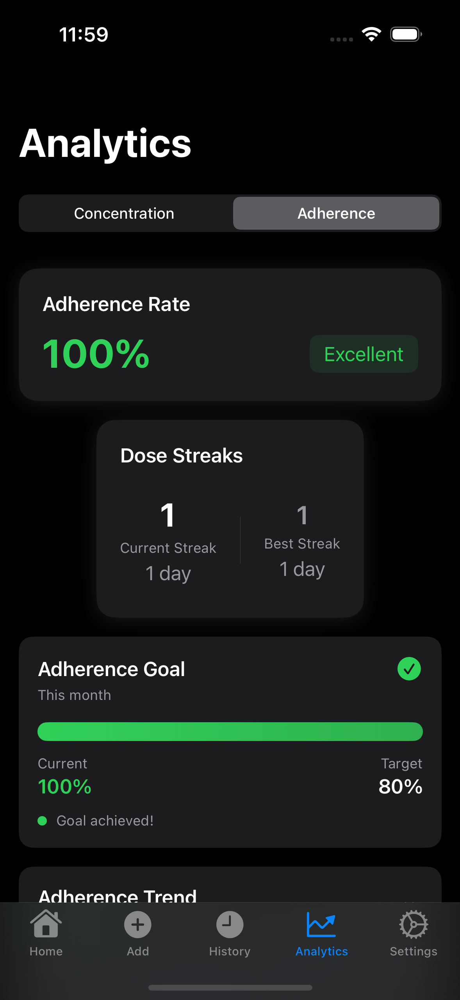
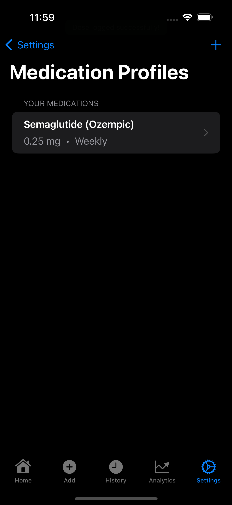
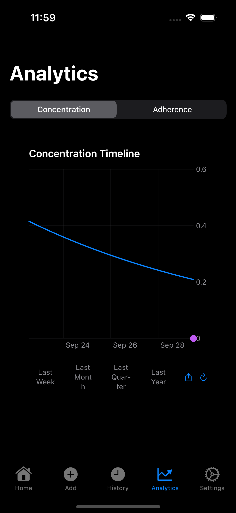

# Analytics UI/UX Design Review

**Issue**: #59 - Analytics Orchestration & Polish
**Phase**: 2 - Evaluation & Design Decisions
**Date**: 2025-09-29
**Status**: Ready for Review

## Purpose

This document captures baseline UI/UX analysis and gathers feedback for analytics interface improvements. Screenshots were captured via comprehensive E2E test enhancements in Phase 1.

---

## Screenshots Reference

### Screenshot Files
- `0D6C454F-CE4F-4C68-8502-05F50C2C5314.png` - Adherence view (above fold)
- `ABBECC93-3C74-49A8-A6C5-FB95344EDE86.png` - Adherence view (scrolled, below fold)
- `B3C245FA-204B-4AB1-BD23-739CB6C54E77.png` - Concentration view
- `E065A154-2317-4E55-93F0-B283750BE0E3.png` - Analytics navigation/controls

---

## 1. Adherence View Analysis (Above Fold)

**Screenshot**: `0D6C454F-CE4F-4C68-8502-05F50C2C5314.png`



### Current State
- **Layout**: Adherence Rate card at top with percentage and status badge
- **Metrics Displayed**: 100% adherence with "Excellent" green badge
- **Dose Streaks**: Current streak (1 day) and Best streak (1 day) side by side
- **Goal Progress**: Adherence Goal card showing 100% current vs 80% target with green checkmark

### Design Questions
1. **Visual Hierarchy**: Is the adherence rate card sufficiently prominent as the primary metric?
2. **Color Coding**: Is the green/excellent color scheme clear and accessible for colorblind users?
3. **Information Density**: Is there too much/too little information above the fold?
4. **Status Badge**: Does the "Excellent" badge add value or is it redundant with the percentage?
5. **Streak Display**: Are the streak counters clear and motivating?
6. **Goal Card**: Is the progress bar + percentage display intuitive?

### Feedback Needed
- [ ] Rate visual appeal (1-5): _____
- [ ] Rate information clarity (1-5): _____
- [ ] Suggested improvements:
  ```


  ```

---

## 2. Adherence View Analysis (Below Fold)

**Screenshot**: `ABBECC93-3C74-49A8-A6C5-FB95344EDE86.png`



### Current State
- **Adherence Trend Chart**: Weekly view showing adherence pattern over time
- **Trend Indicator**: "Declining" status with red indicator
- **Chart Data**: Line graph showing 100% → ~75% → ~90% → ~75% pattern
- **Missed Dose Patterns**: Card showing "5" missed doses with "Worst day: Sunday"
- **Recent Missed Doses**: Calendar view showing dates 24 and 23
- **Insight**: "Most missed doses occur on Sunday. Consider setting additional reminders for this day."

### Design Questions
1. **Chart Readability**: Is the adherence trend chart clear and actionable?
2. **Trend Status**: Is the "Declining" indicator helpful or anxiety-inducing?
3. **Missed Dose Patterns**: Does this section provide actionable insights?
4. **Calendar Visualization**: Is the recent missed doses display effective?
5. **Insight Quality**: Is the automated insight helpful and appropriately worded?
6. **Scroll Discoverability**: Is it clear there's more content below the fold?

### Feedback Needed
- [ ] Rate chart effectiveness (1-5): _____
- [ ] Rate insight helpfulness (1-5): _____
- [ ] Suggested improvements:
  ```


  ```

---

## 3. Concentration View Analysis

**Screenshot**: `B3C245FA-204B-4AB1-BD23-739CB6C54E77.png`


### Current State
- **Chart Type**: Concentration Timeline Chart showing medication levels over time
- **Data Display**: Line graph with dose markers and concentration curve
- **Time Period Controls**: Buttons for "Last Week", "Last Month", "Last Quarter", "Last Year"
- **Visual Style**: Blue line with circular dose markers on timeline
- **Chart Controls**: Time period selector buttons in horizontal layout

### Design Questions
1. **Chart Clarity**: Is the concentration timeline easy to understand?
2. **Dose Markers**: Are the dose event markers clear and discoverable?
3. **Time Period Controls**: Is the button layout intuitive and accessible?
4. **Visual Hierarchy**: Does the chart balance detail with readability?
5. **Therapeutic Range**: Should there be visual indicators for optimal concentration range?
6. **Interactivity**: Are zoom/pan interactions discoverable?

### Feedback Needed
- [ ] Rate chart usability (1-5): _____
- [ ] Rate visual design (1-5): _____
- [ ] Suggested improvements:
  ```


  ```

---

## 4. Navigation & Controls Analysis

**Screenshot**: `E065A154-2317-4E55-93F0-B283750BE0E3.png`



### Current State
- **Segmented Control**: "Concentration" and "Adherence" tab selector
- **Visual Style**: Standard iOS segmented control appearance
- **Placement**: Top of Analytics view below navigation bar
- **State Indication**: Selected state shown with background color

### Design Questions
1. **Discoverability**: Is it clear there are two different analytics views?
2. **Tab Labels**: Are "Concentration" and "Adherence" clear to non-medical users?
3. **Visual Design**: Does the segmented control fit the app's design language?
4. **Touch Targets**: Are the tabs large enough for easy tapping?
5. **Feedback**: Is the selected state sufficiently clear?

### Feedback Needed
- [ ] Rate navigation clarity (1-5): _____
- [ ] Rate ease of use (1-5): _____
- [ ] Suggested improvements:
  ```


  ```

---

## 5. Cross-Cutting Concerns

### Accessibility
- **VoiceOver Support**: All test methods verify VoiceOver accessibility
- **Color Independence**: Text labels complement color coding
- **Touch Targets**: Buttons and interactive elements are hittable
- **Accessibility Labels**: Descriptive labels for all UI elements

#### Accessibility Questions
1. Is color coding sufficient or should there be additional visual indicators?
2. Are chart descriptions clear enough for screen reader users?
3. Do interactive elements have appropriate size and spacing?

### Performance
- **Navigation Time**: ~500-2000ms (baseline measurements captured)
- **Chart Rendering**: Sub-second for typical datasets
- **Interaction Response**: <100ms for button taps

#### Performance Questions
1. Are load times acceptable for medical app context?
2. Does chart interaction feel responsive?
3. Are there any perceived lag or jank issues?

### Consistency
- **Design System**: Cards, colors, typography follow JabTracker design tokens
- **Patterns**: Follows iOS HIG and established app patterns
- **Layout**: Consistent spacing and alignment

#### Consistency Questions
1. Does analytics section feel cohesive with rest of app?
2. Are card styles consistent with other views?
3. Is typography hierarchy clear and consistent?

---

## 6. Priority Issues & Opportunities

### High Priority
- [ ] **Issue**: _____
  - **Impact**: _____
  - **Suggested Fix**: _____

- [ ] **Issue**: _____
  - **Impact**: _____
  - **Suggested Fix**: _____

### Medium Priority
- [ ] **Opportunity**: _____
  - **Value**: _____
  - **Implementation**: _____

- [ ] **Opportunity**: _____
  - **Value**: _____
  - **Implementation**: _____

### Low Priority / Future Enhancements
- [ ] **Enhancement**: _____
- [ ] **Enhancement**: _____

---

## 7. Recommendations Summary

### Must Have (Phase 3)
1. _____
2. _____
3. _____

### Should Have (Phase 3)
1. _____
2. _____
3. _____

### Nice to Have (Future)
1. _____
2. _____
3. _____

---

## 8. Next Steps

### Phase 3: UI/UX Implementation
Based on this review, implement agreed-upon improvements:
1. [ ] Address high-priority issues
2. [ ] Implement must-have recommendations
3. [ ] Update E2E tests for new/changed UI
4. [ ] Verify accessibility compliance
5. [ ] Measure performance impact

### Phase 4: State & Performance Optimization
1. [ ] Profile chart rendering performance
2. [ ] Optimize data loading and caching
3. [ ] Improve perceived performance (loading states, animations)
4. [ ] Validate performance against baselines

---

## Review History

| Date | Reviewer | Key Feedback | Status |
|------|----------|--------------|--------|
| 2025-09-29 | ___ | ___ | Pending |
| | | | |
| | | | |

---

## Appendix: Testing Coverage

### E2E Test Enhancement Summary
- **AdherenceChartsUITests**: 4 test methods, 13 screenshots
- **ChartControlsUITests**: 5 test methods, 15 screenshots
- **AdherenceMetricsDisplayUITests**: 5 test methods, 15 screenshots
- **Total**: 14 test methods with comprehensive screenshot capture

### Performance Baselines Captured
- Navigation timing: 500-2000ms
- Chart load timing: sub-second
- Interaction timing: <100ms
- Refresh timing: measured for all views

### Accessibility Validation
- VoiceOver support verified for all components
- Touch target sizes validated
- Color independence confirmed
- Descriptive labels tested